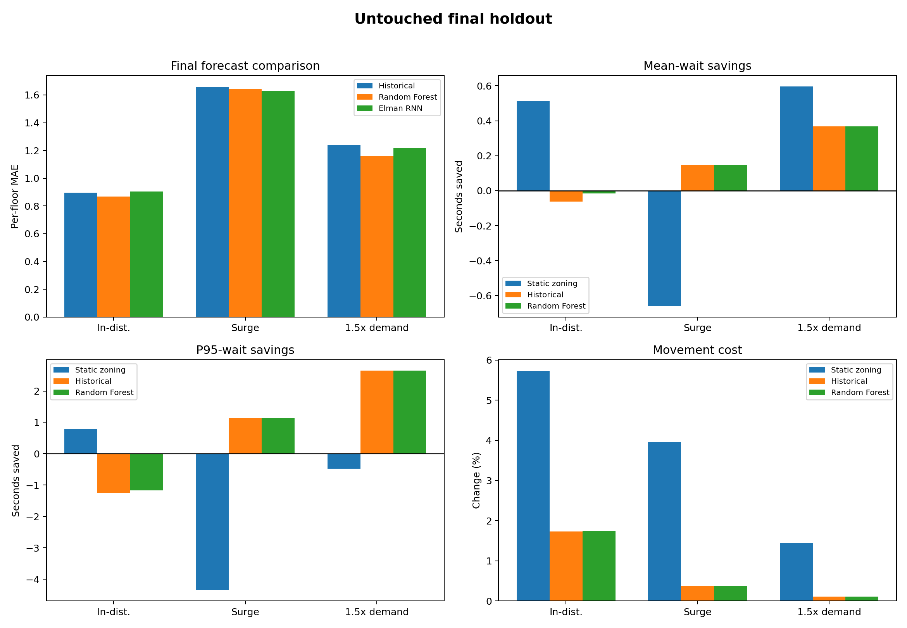

# Forecast-Driven Elevator Group Control Under Traffic Drift

[](https://github.com/mikeyoknow/forecast-driven-elevator-control/actions/workflows/tests.yml)
[](https://www.python.org/)
[](#scope-and-limitations)

An applied machine-learning and digital-twin study of whether short-horizon
passenger-demand forecasts can improve elevator group control when building
traffic changes.

**Authors:** Hannah Abedin and Erfan Razmand

**Course context:** EECS 3404 - Applied Machine Learning, York University

**Project video:** [Watch the end-to-end presentation](https://youtu.be/jJbxqyLPZ4I)



## Research Question

Can per-floor demand forecasts help a controller position service-idle
elevators more effectively, reducing passenger waiting time without creating
excess movement or worse tail service?

The project evaluates forecasting and control as separate layers. This is
important because a model can improve its prediction metric without causing
the downstream controller to make better decisions.

## System at a Glance

```text
Seeded traffic generator
        |
        v
Leakage-safe temporal features -----> Demand forecasters
        |                                  |
        |                                  v
        +--------------------------> Idle-car positioner
                                           |
                                           v
                                Elevator digital twin
                                           |
                                           v
                         Wait, tail, fairness, movement
```

- 15-floor office-building simulation
- Four elevators with a capacity of 12 passengers each
- Independent building-day train, validation, and test splits
- Mean, historical, and persistence forecasting baselines
- Ridge Regression, Random Forest, and a from-scratch Elman RNN
- Nearest-car, static-zoning, historical, Random Forest, and perfect-input
  positioning comparisons
- Paired day-level confidence intervals, ablations, stress tests, and a locked
  final holdout

## Main Results

### Forecasting

On the independent in-distribution holdout, Random Forest improved per-floor
two-minute demand MAE from **0.897 to 0.868** relative to the historical
baseline. The paired reduction was 0.028 passengers, with a 95% bootstrap
interval of **0.011 to 0.046**, and Random Forest won on 14 of 20 days.

### Elevator Control

The forecasting improvement did not translate into better service:

| In-distribution policy | Mean wait | P95 wait | Long-wait rate | Movement |
|---|---:|---:|---:|---:|
| Nearest-car baseline | 16.023 s | 52.413 s | 4.05% | 3,720 floors |
| Static zoning | **15.510 s** | **51.635 s** | **3.77%** | 3,928 floors |
| Random Forest positioning | 16.038 s | 53.580 s | 4.03% | 3,780 floors |

Relative to nearest-car, Random Forest positioning was 0.015 seconds worse on
mean wait, increased P95 wait by 1.168 seconds, and increased movement by
1.75%. Static zoning had the best average service but exceeded the predeclared
5% movement budget, and its wait-time interval crossed zero.

The central engineering result is therefore a negative but useful one:
**better offline prediction does not guarantee operational value**. The
greedy positioner, rather than forecast accuracy alone, is the main bottleneck.

## Methodological Depth

- **Leakage prevention:** every feature ends before its forecast target begins;
  adjacent minutes from one day are never split across training and evaluation.
- **Fair controller comparison:** all policies see the same passengers within
  each simulated day, and passenger service always overrides speculative
  positioning.
- **Baselines before complexity:** learned models are compared with serious
  statistical and non-ML control baselines.
- **Uncertainty:** paired bootstrap intervals use the independent building day,
  rather than correlated passengers or forecast rows, as the sampling unit.
- **Distribution shift:** conclusions are checked under an unseen surge and a
  1.5x demand-intensity condition.
- **Locked evaluation:** the final protocol was frozen before the final seed
  was revealed.

## Repository Structure

```text
configs/                  Experiment and locked-holdout configurations
docs/                     Design decisions, diagnostics, and final findings
report/                   Sanitized LaTeX source for the technical report
results/development/      Selected development tables
results/final_holdout/    Selected untouched holdout tables and snapshots
results/figures/          Portfolio-ready experiment figures
src/elevator_ml/          Simulator, data, forecasting, control, and evaluation
tests/                    Automated correctness and leakage tests
```

## Quick Start

Python 3.11 is recommended.

```bash
python3.11 -m venv .venv
source .venv/bin/activate
python -m pip install --upgrade pip
python -m pip install -r requirements.txt
```

Run the full correctness suite:

```bash
PYTHONPATH=src python -m unittest discover -s tests -v
```

Run development workflows into fresh directories:

```bash
PYTHONPATH=src python -m elevator_ml audit-data --output reproduced/data_audit
PYTHONPATH=src python -m elevator_ml train-forecasters --output reproduced/forecasting
PYTHONPATH=src python -m elevator_ml evaluate-controllers --output reproduced/controllers
PYTHONPATH=src python -m elevator_ml run-robustness --output reproduced/robustness
PYTHONPATH=src python -m elevator_ml train-sequence-models --output reproduced/sequence_models
```

See [REPRODUCIBILITY.md](REPRODUCIBILITY.md) for the complete workflow and
[docs/FINAL_RESULTS.md](docs/FINAL_RESULTS.md) for the full interpretation.

## Technical Report

The sanitized public report contains the complete methodology, equations,
experiments, diagnostics, limitations, and references:

**[Read the 30-page technical report](docs/Forecast_Driven_Elevator_Control_Report.pdf)**

The corresponding LaTeX source is retained in `report/`.

## Verification

The release state contains **74 passing tests** covering configuration,
synthetic traffic generation, feature alignment, leakage guards, forecasting,
the NumPy RNN, controller behaviour, simulator invariants, metrics,
robustness, operational-value analysis, and the locked evaluation protocol.

GitHub Actions runs the same test suite on every push and pull request.

## Scope and Limitations

- Passenger traffic is synthetic and is not calibrated to a particular
  physical building.
- The digital twin simplifies doors, motion, boarding, and routing.
- The project studies forecast-assisted idle-car positioning, not a complete
  commercial elevator controller.
- Movement is an operational proxy, not a calibrated energy measurement.
- Floor-level service differences are not demographic fairness measures.
- Deployment would require real-building calibration, safety engineering,
  privacy review, drift monitoring, and field validation.

## Joint Ownership

Hannah Abedin and Erfan Razmand developed the project jointly and share
ownership across problem formulation, system design, implementation review,
experimentation, validation, interpretation, documentation, and presentation.
No subsystem or result is presented as the exclusive work of either author.

See [CONTRIBUTORS.md](CONTRIBUTORS.md) for the public contribution statement.

## Responsible Use

This repository is a research and educational prototype. It is not certified
for controlling real elevators or other safety-critical equipment.
